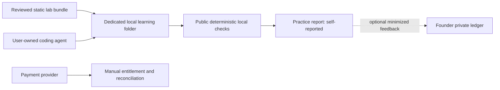

# Kiến trúc có điều kiện — chưa implement

2026-10-07. Quyết định sau [PRODUCT_THESIS](PRODUCT_THESIS.md) và [MVP](MVP.md). Tất cả cấu phần dưới đây là DESIGN; không phải hệ thống đã chạy.

Owner bổ sung yêu cầu thiết kế chi tiết/màn hình và ưu tiên ít vốn: [blueprint](blueprint/README.md) là bản cụ thể hóa sau hai phản biện độc lập. Static/manual vẫn mặc định; không VM/app DB. Hosted S2 phải qua incremental ROI và kiểm tra tiền mặt riêng. Nguyên mẫu không thực thi payment/auth/lab.

## P0–P3: ít thành phần nhất

P0: tài liệu tĩnh + private ledger + payment link/invoice từ merchant hợp lệ. P1: immutable bundle của nội dung synthetic, Python standard library và local tests. Public Git chỉ giữ demo/manifests/advisories; paid artifacts/reference/probes giao riêng theo stage, không commit chúng vào public history. P2/P3: delivery/entitlement đối soát thủ công. Không server execution, database, queue, API model hay custom CLI installer.

Learner tự mở coding agent của họ. CodeForge không spawn agent, không đọc ~/.config, không thu token/transcript, không proxy subscription của nhà cung cấp. Hướng dẫn agent là optional plain text, không phụ thuộc prompt syntax riêng. Manual solving vẫn dùng được.

Local execution là ranh giới rủi ro ở máy learner, không sandbox security guarantee. Python venv không cách ly filesystem/network. P1 không nhận arbitrary challenge repo/plugin; chỉ bundle do founder review, không install script, không dependency bên thứ ba, không network trong test chuẩn. Agent vẫn có thể viết code độc hại; phải hướng dẫn quyền hẹp, repo synthetic, không production credentials. Nếu learner/team không chấp nhận local risk, dùng static review-only experiment; không lén thêm cloud execution.

## Khi nào thêm modular monolith

Chỉ sau G3/G4, first-order profit và bottleneck>2h/tuần trong2 tuần, có payback build+security+maintenance≤90 ngày ở actual volume. Cắt việc hoặc dùng merchant delivery trước. Một Next.js app với server modules; Supabase Postgres/Auth/optional Storage; Vercel một deployment. Python lab là static artifact, không backend thứ hai. Không microservice, Redis, event bus, vector DB, Kubernetes, event sourcing hay background evaluator.

| Lựa chọn | Quyết định và trigger |
|---|---|
| Supabase | Hợp lý khi cần accounts/persistence; chưa cần P0. SQL chuẩn + migrations trong repo; RLS/read-own kiểm tra thực. Auth/storage APIs là lock-in cần adapter mỏng. Free có pause/backups hạn chế [I1](MARKET_RESEARCH.md#infrastructure). |
| Vercel | Hợp lý để web nhỏ; commercial plan dự trù Pro, không dùng Hobby cho thương mại [I2/I3](MARKET_RESEARCH.md#infrastructure). Static docs/invoice P0 tránh cần host thương mại riêng. |
| Local CLI | Chưa publish package; dùng Python stdlib command đã kiểm tra. CLI download/upload/auto-update chỉ khi support data chứng minh lợi ích. |
| Git | Version/distribute challenge; ZIP cho người không muốn clone. Pin release/hash; không git hook/submodule tự chạy. |
| Container | Không default requirement; Docker setup có thể đắt hơn lab. Chỉ optional profile đã review nếu cần reproducibility; container không chứng minh chống host compromise [I7](MARKET_RESEARCH.md#infrastructure). |
| Object storage | Chưa cần cho tiny static artifacts; sau này bucket private nếu bán content, không learner source uploads. |
| Queue | Không workload async ở MVP → không queue. Payment webhook synchronous transaction, periodic manual reconciliation. |
| Evaluator | Local, deterministic, public, report không đáng tin để tuyển dụng. Không hidden test secret trên máy adversarial. |

## Domain boundaries khi có web

Catalog, Commerce, Delivery, Identity/privacy, Operations nằm trong cùng app; Practice chỉ là hiển thị local, không ghi DB. Phản biện blueprint đã loại app practice history/feedback storage và login CodeForge trước thanh toán ở flow mặc định. Support dùng merchant/private channel; research consent không khóa quyền học. Không hiring/mastery/adaptive domain hay generic LLM framework.

Schema/API hiện hành tập trung tại [SYSTEM_DESIGN](blueprint/SYSTEM_DESIGN.md): tám conceptual tables là trần tham chiếu, không backlog. Orders cho phép chưa claim; không auto-link email. Event received/unresolved khác applied. Direct buyer Storage access bị từ chối, signer hẹp kiểm cùng order/stage/quarantine; không chỉ che UI. Không tạo practice_reports/feedback tables trong default S2.

Trước khi dùng accounts: anon/A/B ownership tests trên DB và API thật; service-role chỉ payment/admin/asset-signer tách nhỏ; không shortcut authorization. RLS bật mọi exposed owner table. Staff role do server quản lý. Cookie mutations check origin/CSRF; authenticated responses no-store. Theo tài liệu [I6](MARKET_RESEARCH.md#infrastructure), privileged keys có thể bypass RLS; không đưa vào client.

## Versioned contracts (thiết kế, chưa là executable schema)

`challenge.json`: `schema_version=1`, stable id, `content_version=1.0.0`, title, competency_ids, Python runtime range, exact tested runtime, supported OS list, starter_sha256, evaluator_version/hash, fixture_seed, max_expected_seconds, assistance_policy, license/provenance, review_record. Không arbitrary shell command trong manifest, không fetch URL do learner cung cấp.

`evaluator.json`: schema_version, evaluator_version, invariant check IDs, fixture digest, comparator exact semantics, max report bytes, reference pass and mutant fail evidence. Public outcomes = pass/fail/error per check + explanation IDs. Error/timeout không phải skill failure. P0–P3 không có hidden tests; reserve term “unseen transfer” cho bài mới, không “secret”.

`submission/report.json`: schema_version, random submission_id, challenge/version/hashes, evaluator/runtime version, optional agent_family/model self-report, check_results enum, duration optional/self-reported, `trust_level=self_reported`. Không embedded code, URL, command, stdout/stderr, path hoặc free-form transcript. Toàn bộ tối đa 16 KiB, 50 check records, finite bounded numbers. Learner xem preview trước chia sẻ; parser từ chối extra fields/binary.

Content/evaluator major version thay scoring semantics; patch chỉ typo không đổi answer. Bất kỳ đổi expected result tạo version mới. Server unknown major → 422; không silently coerce. Report cũ giữ version, không so sánh như cùng benchmark. Quarantine nội dung lỗi, báo người bị ảnh hưởng và cấp retry/refund khi phù hợp; không rewrite lịch sử thành “đúng”.

API tương lai theo SYSTEM_DESIGN; không report/feedback write routes. Export là GET phân trang giới hạn, không background job hay truncation. Custom checkout bị defer nếu merchant-native flow giải quyết được. 401/403/404/409/422/429/503 có error code/request_id, không SQL/stack trace. Direct DB/Storage paths phải giữ cùng invariant; request quota không là trần hóa đơn nhà cung cấp. Local report contract phía trên vẫn dùng cho practice/private consented research, không ngụ ý upload API.

## Migrations, portability, recovery

Migrations SQL versioned, thử reset/seed và export/restore trước dữ liệu thật; expand → backfill bounded → switch → contract sau rollback window. JSON export gồm versions và consent; PII không vào repo. Trước Supabase data: thử pg_dump/restore sang PostgreSQL sạch; auth password/session không hứa migrate trơn tru, có thể yêu cầu đăng nhập lại. Không Vercel-specific business logic; test build self-hostable trên Node sau khi thực sự cần migrate.

Không schema migration lên production trong task planning. Private ledger backup mã hóa với restore drill trước payment; tách mapping email khỏi research observations. Khi web có dữ liệu: daily backup và weekly restore spot check, runbook 24h RPO/1 business day RTO ở pilot (hypothesis phải diễn tập). Provider outage: static assets vẫn chạy, ghi report local, manual receipt reconciliation; không mất bài chỉ vì app down.

## Observability và privacy

Events allowlist: offer_seen, demo_received, first_check, lab_completed, lab2_started/completed, transfer_completed, purchase_settled/refunded; mỗi event pseudonym, timestamp UTC, version, channel và assistance mode; không prompts/code/email/IP dài hạn. Server-received payment đáng tin hơn client learning event. Log errors/request IDs không request body, TTL7ngày; raw pilot observations30ngày từ collection. Baseline bắt đầu lúc content delivery, delayed≤14ngày, đóng matched results trước TTL rồi chỉ giữ aggregate90ngày và review. Contact/order map riêng qua delivery+30ngày support/refund; payment retention phụ thuộc merchant/law, xác nhận trước thu tiền; không hứa xóa khỏi backup ngay. Xem VALIDATION_PLAN cho denominator và cohort closure.

Chỉ opt-in de-identified error category dùng cải thiện corpus; không tuyển dụng/marketing profiling, không bán telemetry. User-owned agent có data policy riêng; “local compute” không có nghĩa code không đi cloud. Factory content synthetic giảm hậu quả nhưng không xóa risk. Có opt-out feedback mà vẫn học được.
