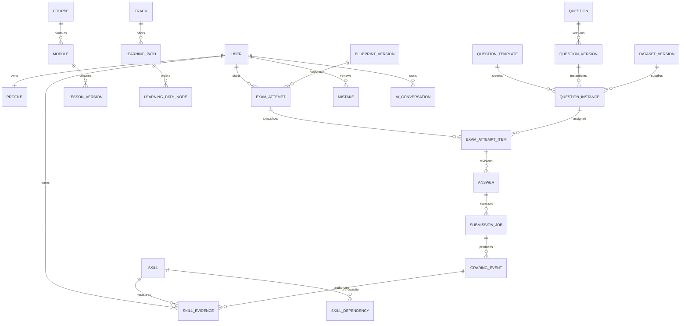

# Data Model

## Conventions and invariants

UUID keys; UTC timestamptz; monetary units integer minor units; immutable version rows. Index owner + created_at, attempt + revision, skill + version và job state/lease_until. Foreign keys và unique constraints là bắt buộc; JSONB chỉ cho cấu trúc đặc thù có schema validation, không thay quan hệ cốt lõi.

## Entity inventory và ownership

| Brief entities | Physical target | Quyền / invariants |
|---|---|---|
| User, UserProfile | auth.users, public.profiles | Profile chỉ owner; không có learner-editable role/score |
| Skill, SkillDependency | skills, skill_dependencies | Catalog được duyệt; DAG validator trước publish |
| UserSkill | user_skill_snapshots, skill_evidence | Learner read-own; server append evidence; versioned projection |
| Course, Module, Lesson | courses, modules, lesson_versions | Draft author-only; published immutable |
| LearningPath, LearningPathNode | learning_paths, learning_path_nodes | Template version; learner enrollment riêng |
| Question, QuestionVersion | questions, question_versions | Prompt/metadata tách khỏi private grading data |
| QuestionTemplate, QuestionInstance | question_templates, question_instances | Seed/family/runtime/dataset hash pinned |
| Answer, Attempt | answers, attempts | Owner read; writes qua authorized transaction, revision/idempotency |
| Exam, ExamAttempt | exams, exam_attempts, exam_attempt_items | Server deadline; snapshot assigned items |
| CodingChallenge, TestCase | coding_challenges, private.test_cases | TestCase private; public examples là bản tách riêng |
| Dataset | datasets, dataset_versions | Immutable hash/license; private object ACL |
| Mistake, Recommendation | mistakes, recommendations | Owner; algorithm/input snapshot recorded |
| Achievement, StudySession | achievements, user_achievements, study_sessions | Không dùng XP làm chứng cứ mastery |
| AIConversation | ai_conversations, ai_messages | Owner; retention/consent, no hidden keys |
| ContentSource | content_sources | URL/license/date/fact type/reviewer |
| Cohort, Track, AssessmentBlueprint | cohorts, cohort_members, tracks, blueprint_versions | No cross-cohort sharing by default; authorization scoped |
| Hạ tầng bổ sung | submission_jobs, grading_events, outbox, idempotency_keys, audit_events, staff_memberships | Privileged writes; keys scoped actor+route; audit minimized |

## ERD định hướng

ERD này mô tả target, không khẳng định toàn bộ bảng đã được migrate. F1 chỉ schema auth/profile/skill catalog; F2 thêm assessment ledger; phần CMS/cohort/achievement theo roadmap. Implementation phải giữ entity mapping, không bỏ yêu cầu chỉ vì chưa tạo bảng.

## Constraints quan trọng

Unique `(actor_id, route, idempotency_key)` cùng request_hash. Unique `(attempt_item_id, answer_revision)`; `deadline_at > started_at`; score/check bounds; `(grading_event_id, skill_id)` unique để chống double-credit. Job lease claim phải atomic, không SELECT rồi UPDATE rời. Phân biệt trusted server receipt time và untrusted client timestamp.

Published content UPDATE bị từ chối ở DB/role layer; correction tạo version mới. Private schema không expose qua Data API; revoke schema/table/function privileges khỏi anon/authenticated. SECURITY DEFINER functions chỉ dùng khi cần, fixed search_path, explicit owner check, revoke public execute, grant tối thiểu. Không giao quyền admin qua metadata người dùng có thể sửa.

## RLS matrix bắt buộc test thực

Anon không xem profile/attempt/keys; learner A không đọc/sửa B; learner không tự đổi score, deadline, assigned items hay staff role; author không publish nếu thiếu reviewer policy; private tests/storage không public; user-scoped backend vẫn chịu RLS. Service role bypass phải bị giới hạn server và có policy checks riêng. Các test này chưa được chứng minh bởi domain tests.

## Deletion and history

Xóa tài khoản xóa/anonymize PII theo policy, xóa provider conversation và storage liên quan. Giữ thống kê aggregate không nhận dạng khi được phép; không hứa xóa tức thì khỏi backup. Thời hạn backup và retention phải được xác nhận trước pilot. Content version lưu vì reproducibility, không dùng làm lý do giữ PII vô hạn.
