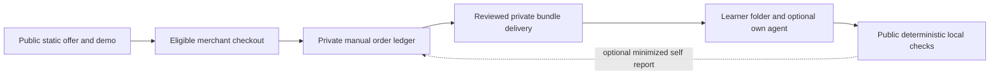
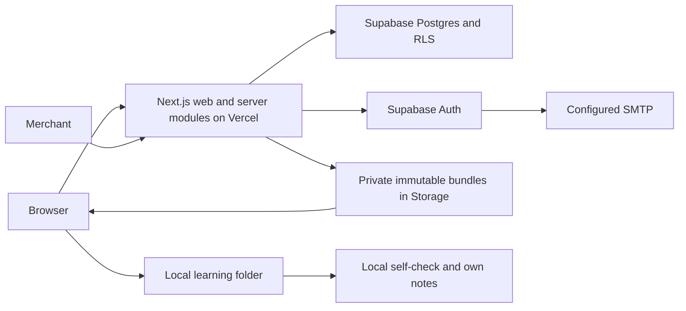

# System design — staged, replaceable, no runner service

2026-10-07. DESIGN only; no migrations/API/framework installed. [Hosting sources](HOSTING_DECISION.md) H01–H14 checked2026-10-07. Additional technical sources checked same date: [Supabase SSR](https://supabase.com/docs/guides/auth/server-side/creating-a-client?queryGroups=framework&framework=nextjs), [RLS](https://supabase.com/docs/guides/database/postgres/row-level-security), [Storage access](https://supabase.com/docs/guides/storage/security/access-control), [DB connections](https://supabase.com/docs/guides/database/connecting-to-postgres), [Python releases](https://www.python.org/downloads/).

## System boundaries

This is S0/S1. No application server sees learner code or API keys. Public files contain no reference/probe/paid artifact. Private delivery must have named-recipient access or merchant delivery controls, version/integrity records and an off-provider backup. A ZIP downloaded by a buyer is copyable; no DRM promises.

Conditional S2 replaces the manual order/delivery bottleneck, not the learning execution boundary:

Two hosting vendors are not two total dependencies: merchant, SMTP and private backup are operational dependencies too. None requires a VM. No queue, realtime, persistent WebSocket, vector database or LLM call in the design.

## Technology choices

Localization extension: [LOCALIZATION](LOCALIZATION.md) specifies static catalogs and language selection in the synthetic prototype. No runtime translation API, country-specific database or language-profile storage. Future locale routes are a presentation concern in the same app; source content/evaluator versions stay shared. This does not add a service or alter paid-country eligibility.

S0 prototype/offer: plain HTML/CSS and small browser interaction; no framework build required. S1 content: Python standard library, one supported runtime minor selected and exactly tested at G1; do not claim the learner runtime is tested today. Git versions manifests/public demo; paid authoring storage is private.

S2: TypeScript, currently-supported stable Next.js (observed Active LTS16) + React version supported by that release; Node24 LTS with latest security patch at implementation. One app, standard server runtime, ordinary forms/semantic CSS. No monorepo framework, ORM, design-system package or LLM SDK by default. Use Supabase client/SSR SDK behind small adapters; versioned SQL migrations and generated DB types. Zod or a similarly small schema validator is a conditional implementation choice, not installed now. Use existing Node test runner and a few browser integration tests; Python unittest for trusted lab fixtures.

Supabase REST/RPC over HTTPS avoids arbitrary connection-per-request design. If direct SQL becomes necessary, use the documented pooler mode appropriate to short-lived functions, bound pool sizes and connection load tests; do not mix session-specific assumptions with transaction pooling. Place app functions near the actual DB region. Historical project was reported Tokyo; inspect actual region/data before considering Singapore or migration.

## Module ownership

| Module | Owns | Must not do |
|---|---|---|
| Catalog | Public descriptors, immutable reviewed versions, publish/quarantine state | Read customer research notes or mutate historical results |
| Commerce | Server price/product, merchant order state, entitlement | Trust return URL/client price or accept score as payment |
| Delivery | Versioned asset entitlement, short-lived download access, debrief stage | Execute code, expose storage listing or let client choose arbitrary object key |
| Practice presentation | Ephemeral local self-report and reflection; no app persistence | Claim attestation, ingest code/stdout/transcript, turn score into unlock/payment |
| Identity/privacy | Session, explicit consent, own export/delete | Let a profile field grant staff rights |
| Operations | Reconciliation/quarantine/audit with owner authority | General CMS, workflow engine, employer ranking |

Use ordinary in-process module calls. Providers are thin interfaces for payments, identity, persistence and delivery; do not invent a generic provider orchestration layer. Domain types do not import Vercel-specific APIs. There is no AI provider adapter because there is no paid AI call.

## Minimum data when S2 is justified

Conceptual schema, not executable SQL. UUIDs, UTC timestamps, integer minor currency amounts; versions immutable after publication.

| Table/domain | Important fields / constraints | Access |
|---|---|---|
| profiles | auth user id PK, active/deleting/deleted lifecycle, consent version, timestamps | Owner minimal read; server lifecycle writes; no writable role/display-name feature |
| product_versions | immutable id/version, currency, price_minor, included challenge version IDs, terms version | Public descriptors; server-controlled pricing/publication |
| challenge_versions | stable challenge ID, content/evaluator/runtime versions, digests, review state | Public manifest only; private object keys excluded from public view |
| orders | nullable verified user FK until claim, private immutable original delivery reference, product version FK, provider_order_id unique, state, financial amounts/version | Owner read after verified assignment; server/verified merchant mutate; no email-string auto-link |
| payment_events | provider+event_id unique, digest, received/unresolved/applied/rejected state, bounded failure/replay metadata, financial version | Server only; no raw card data or full webhook retention |
| entitlements | user+product/order, status; derived transactionally from order state | Owner read; server only write |
| deliveries | user/order, challenge_version, allowed stage, delivery timestamp, withdrawn flag; correction_of release and reason when replaced | Server-controlled; recipient can read own granted descriptors; explicit corrective grant preserves original purchase |
| operation_audit | actor, action, object ID, reason category, timestamp, request ID | Owner operator read; append from authorized actions; no secrets/body |

Eight conceptual tables remain after deleting app practice history and feedback storage. These are a ceiling for a conditional reference, not a minimum implementation backlog. Keep support in the actual merchant/private channel; keep the user's reflection in their own notes. No generic organizations/teams/roles engine, lesson progress graph, transcript store or mastery table. Measurement probes and blinded research rubric stay in the private research workflow. Store only aggregate experiment outcomes in public Git.

## Auth and trust rules

Prefer an eligible merchant's native guest purchase/delivery. No CodeForge login before payment by default. An optional later library may use email OTP, without GitHub permissions; it must earn its own ROI. Historical/manual orders are assigned by the owner after proof of control of the original delivery channel, never from an order number, forwarded receipt or requester-supplied email alone. Keep old S1 delivery working if a claim is ambiguous. Email changes require the same controlled recovery, not bulk matching. The real merchant's capabilities must be verified before selecting this flow.

Custom SMTP, sender/provider-side auth limits and delivery/recovery tests are prerequisites to OTP; test direct provider requests and proxy handling as well as app routes. Support/refund contact remains available without login. No browser secret key. Use verified server-side auth claims per current Supabase SSR guidance; do not trust getSession cookie data alone. RLS independently enforces active lifecycle and owner access for direct API calls too.

Service credentials bypass RLS and stay server-only in narrow payment/admin and asset-signing adapters. Ordinary learner reads use user-scoped clients; no direct buyer INSERT/UPDATE grants for orders, deliveries, audit or lifecycle. Staff allowlist is server-controlled; require current MFA assurance at each privileged action, not only the provider console, and reauthentication for destructive actions. Redirects are allowlisted. Mutations verify origin/CSRF as appropriate; every handler authorizes independently. Personalized responses are no-store. RLS tests include anonymous, userA, userB, deleted users and privileged integration separately.

Static files are public even if navigation hides them. Direct buyer/anonymous Storage list/read/sign operations are denied. The narrow trusted signer receives only a server-resolved release ID, verifies active user, current order, explicit delivery grant and quarantine, and issues a≤60s signed URL; it cannot accept arbitrary object keys. Test the same buyer's direct read/sign paths, not only cross-user access. A≤10MiB/lab initial bundle target and≤10 signing requests/day are hypotheses to test on slow connections, not one-download semantics or a billing cap. Failed expiry has an explicit retry/manual support route. Logs exclude URL/token; downloaded bytes cannot be recalled. Copying risk is accepted rather than adding DRM.

## API contracts — future only

Every mutation rejects unknown fields, has a request ID, bounded size/rate and idempotency where money/state can repeat. Webhook signature uses raw body and verified timestamp; error logs never store full payload.

| Route | Contract / limit | Authority and failure |
|---|---|---|
| GET /api/v1/catalog | Published descriptors only | Public; no private object keys or draft answers |
| POST /api/v1/checkout (deferred) | Only if merchant-native checkout cannot solve a measured bottleneck; product_version only,≤1KiB | Auth-bound custom intent and server price; separate ROI decision, not required for default guest purchase |
| POST /api/v1/payment-events | Signed provider event; endpoint-specific≤256KiB input cap adjusted to actual merchant spec | Verify provider+signature+amount/currency/product/order; persist normalized event+transition transaction; duplicate harmless |
| GET /api/v1/me/orders | Own minimal order state; page≤25 | Never look up by email supplied by requester |
| POST /api/v1/downloads | release ID + stage,≤1KiB | Auth+entitlement+version status;≤10requests/day/account initially;403/409 with safe next step |
| GET /api/v1/me/export | Own records, stable cursor pages≤100records/256KiB, explicit next cursor/end | Reauth; complete paginated export, no silent truncation or background job |
| DELETE /api/v1/me | Reauth + explicit consequences | No hard-delete order evidence required by merchant/law; separate pseudonymization and retention policy |

The earlier high-level export design used POST; this blueprint selects read-only paginated GET, without a stored export job. There is no app report/feedback write endpoint: these were eliminated after red-team review. Any later persistence needs a new value/ROI decision, DB-level bounds, atomic quotas and finite retention before any write grant. Browser-only practice data does not need an account or export service.

Deletion lifecycle: mark deleting and deny app reads/writes/downloads first; revoke refresh access; erase optional identity data; detach nullable order user linkage while preserving necessary pseudonymous financial evidence and a minimized deletion marker. RLS and signer check lifecycle even for unexpired tokens. Late webhooks update financial records only and cannot recreate profiles or entitlements. New signup with the same email never inherits old claims automatically. Publish actual merchant retention and completed/pending deletion status; no promise of instant cross-provider erasure.

## Payment state and failure cases

Prefer merchant-native payment and manual reconciliation while viable. If custom checkout is eventually justified, persist an intent before external creation; serialize one active user+SKU intent, derive a stable merchant idempotency reference, and reconcile an orphan after merchant success/app crash. If the merchant cannot safely support this, do not automate checkout. Test simultaneous tabs with different client keys.

States: created→pending→paid→refunded; cancelled/expired from unpaid states; disputed or exceptional partial adjustment suspends new delivery pending an explicit owner decision. First SKU is full-pack/full-refund under the real disclosed merchant terms. Do not infer a half-pack entitlement. A resolved dispute resumes only from verified current merchant state and a recorded access decision. Preserve financial adjustments/reversals; do not assume every amount only increases. Late/stale paid snapshots cannot regrant a fully refunded order. Serialize/version-check order updates against stored state after remote lookup; ID dedupe alone is insufficient.

DB transaction commits applied-event status, validated order transition and entitlement/delivery effect together. If receipt is stored before a required remote lookup, it remains explicitly received/unresolved; a retry must attempt processing/reconciliation, never treat existence as success. ACK only applied or terminal rejected events with recorded reason; transient/unresolved handling is retryable under the actual merchant contract and visibly enters the owner's bounded replay ledger. Test each crash point and reverse-order concurrent snapshots. No silent loss behind a successful duplicate response. Purchase-return status shows pending/manual support instead of inviting another charge.

No queue needed at the observed scale. Owner reconciliation daily is the recovery path for merchant retry exhaustion; admit no new orders when safe reconciliation unavailable. A future trusted cron is not a learner-code worker or a reason to rent a VM.

## Asset and report contracts

Reuse existing ARCHITECTURE schema_version1/content/evaluator version rules. A public manifest can assert a reviewed version/digest, not an execution attestation. Evaluator output is deterministic on pinned fixtures, but the user can alter it. Error/timeout describes tool state, not skill failure. Unknown major rejected, old supported version labelled, quarantined version cannot produce a trusted new report.

No public hidden tests. Private research forms delivered in the schedule fixed by VALIDATION_PLAN; copying is possible, contamination tracked, never fixed with intrusive monitoring. Provider/model family optional and self-reported, not a leaderboard normalization algorithm.
